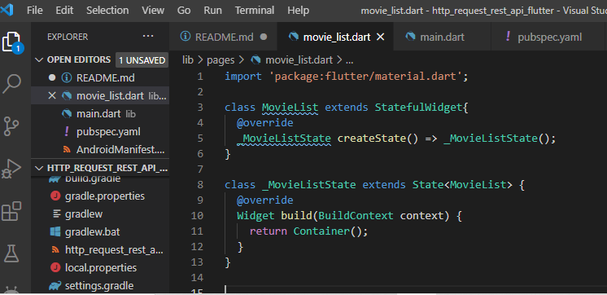
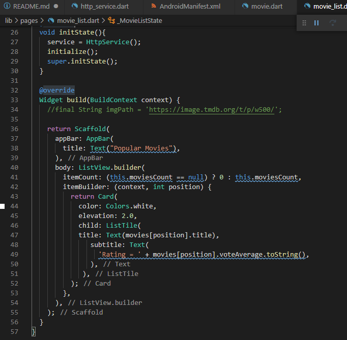

# http_request_rest_api_flutter

A new Flutter project.

## 7.2 Persiapan Project 

Untuk membuat project ini anda membutuhkan : 
1. Api Key dari themoviedb.org untuk mendapatkan api key dapat mengikuti tutorial berikut ini : 

a. <https://www.dicoding.com/blog/registrasi-testing-themoviedb-api/>

b. <https://stackoverflow.com/questions/31047815/api-key-for-themoviedb-org>

2. Library Flutter http

a. Setelah project flutter berhasil dibuat tambahkan library http ke project tersebut. Untuk menambahkan library bisa menggunakan plugin vscode pubspec assit atau mengikuti tutorial disini

b. <https://stackoverflow.com/questions/59915827/how-to-add-a-library-to-flutter-dependencies>

3. Jika ada permintaan update flutter lakukan flutter upgrade.

## 7.3 Koneksi ke REST API
### 7.3.1 Menguji koneksi di dashboard api themoviedb

Untuk menguji koneksi ke REST API themoviedb dapat dilakukan di link berikut ini <https://developers.themoviedb.org/3/movies/get-popular-movies> pada link berikut anda dapat menguji dan membuat request ke server themoviedb dan melihat response nya dalam berbagai format json.

### 7.3.2 Mengkoneksikan Aplikasi Flutter ke themoviedb dengan package http

Untuk mulai mengkoneksikan aplikasi flutter yang dibuat ke rest api themoviedb.org lakukanlah langkah berikut:

1. Untuk mengakses internet kita harus menambahkan permission internet pada android manifest cari lah file android manifest.xml pada folder android/app/scr/main/AndroidManifest.xml kemudian tambahkan permission internet.

2. Hapus komentar yang ada pada file main.dart dari kode program awal.

3. Ubah MyHomePage menjadi stateless widget.

4. Buat file baru baru “pages” pada folder lib dan buat sebuah file dengan nama movie_list.dart.

5. Buat sebuah statefull widget pada file movie_list.dart

6. Import File movie_list.dart ke main.dart dan gunakan movie_list.dart sebagai return dari class MyHomePage

7. Sebelum melanjutkan ke pembuatan aplikasi kita buat terlebih dahulu sebuah helper class untuk konek ke rest api themoviedb. Buat lah sebuah folder dengan nama service dan isi dengan file http_service.dart.

8. Selanjutnya buat sebuah function untuk mengambil response dari server
themoviedb.org

9. Update file movie_list.dart agar dapat menggunakan file httpService dan mereturn
kan widget scaffold.

10. Pada function _MovieListState tambahkan variabel berikut ini untuk variabel service
jangan lupa import dulu file httpservice nya.

11. Kemudian tambahkan method override init state agar permintaan ke rest api dapat
dilakukan ketika state di inisialisasi.

12. Selanjutnya update function build pada movieListState dengan menggunakan widget
scaffold.

### 7.3.3 Membuat model untuk response http

1. Buat folder models didalam folder lib dan isikan dengan file movie.dart

2. Di dalam movie.dart buat lah sebuah class movie lengkap dengan variabel dan
construktor seperti dibawah ini.

3. Selanjutnya buatlah sebuah function untuk mengkonversi json menjadi response yang
sesuai dengan class movie.

4. Selanjutnya update function http_service.dart menjadi seperti dibawah ini.

5. Sampai pada tahap ini aplikasi anda tidak dapat berjalan dengan baik, biarkan dan
lanjutkan ke langkah selanjutnya untuk membuat list populer movie.

## 7.4 Membuat halaman list Populer Movie

Untuk membuat list view pada widget movie list anda memerlukan beberapa widget baru
antara lain list view dan card. Selain itu juga dibutuhkan data dari http service. Langkah
langkah yang perlu dilakukan adalah sebagai berikut :

1. Update inisialisasi variabel pada class movieliststate

2. Tambahkan method initialize() pada class movieliststate

3. Tambahkan function initialize pada initState

4. Selanjutnya buat listview dan card berdasarkan data dari initialize

5. Lakukan hot restart dan aplikasi akan berubah menjadi seperti dibawah ini.

## 7.5 Membuat halaman detail Populer Movie

1. Untuk membuat perpindahan dari movie list ke movie detail buatlah onTap event di
listview pada movie list.

2. Pada event on tap Widget MovieDetail belum dibuat, buatlah widget ini pada folder
pages/movie_detail.dart.

3. Lengkapi Movie Detail untuk menerima parameter Movies

4. Lengkapi detail widget.

